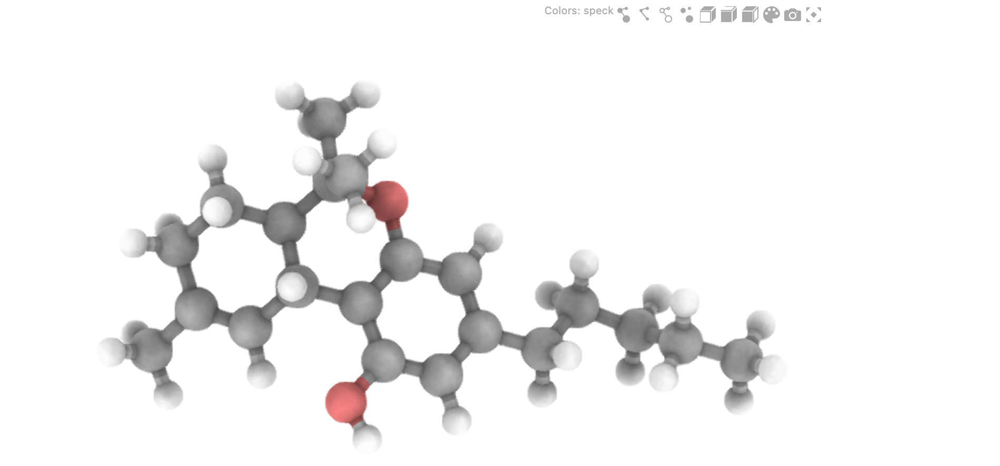

# Awesome Atomistic Visualizations 

Collection of packages to visualize the atomistic structure of molecules and crystals, tested on Python 3.9 and VSCode Notebook.

## [ASE-Notebook](https://github.com/danieleongari/awesome_atomistic_visualizations/blob/master/notebooks/ase_notebook.ipynb)

## [JSME](https://github.com/danieleongari/awesome_atomistic_visualizations/blob/master/notebooks/jsme.ipynb)

Only SMILES input/output

## [JSMol](https://github.com/danieleongari/awesome_atomistic_visualizations/blob/master/notebooks/jsmol.ipynb)

> Not working on VSCode Notebook

## [NGLView](https://github.com/danieleongari/awesome_atomistic_visualizations/blob/master/notebooks/nglview.ipynb)

## [Speck](https://github.com/danieleongari/awesome_atomistic_visualizations/blob/master/notebooks/speck.ipynb)

