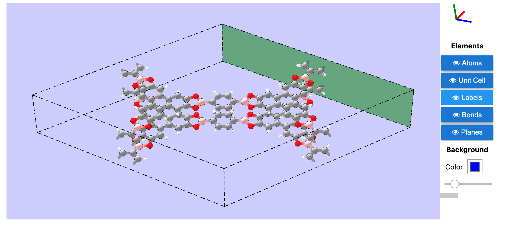
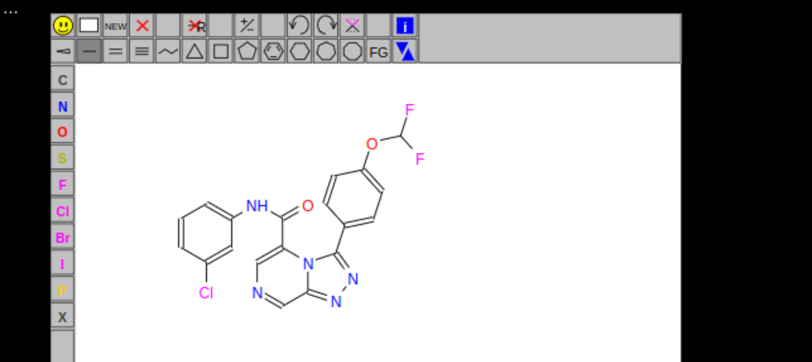
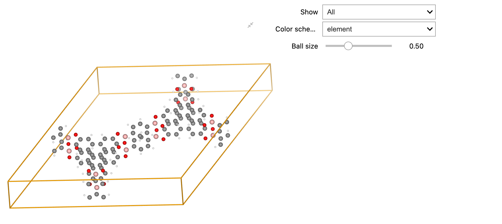

# Awesome Atomistic Visualizations 

Collection of packages to visualize the atomistic structure of molecules and crystals, tested on Python 3.9 and VSCode Notebook.

## ase-notebook - [GitHub](https://github.com/chrisjsewell/ase-notebook), [Docs](https://ase-notebook.readthedocs.io/en/latest/)

## JSME

Only SMILES input/output

## JSMol

> Not working on VSCode Notebook

## nglview - [GitHub](https://github.com/nglviewer/nglview), [Docs](https://wiki.fysik.dtu.dk/ase/ase/visualize/visualize.html)

